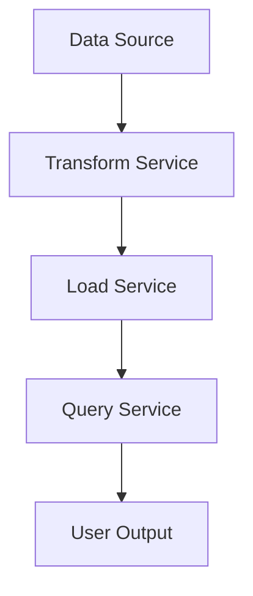

# Transform, Load, Query (TLQ) Pipeline

## Overview
The Transform, Load, Query (TLQ) Pipeline is a serverless, cloud-native application framework designed to process and analyze large datasets efficiently. Similar to an Extract-Transform-Load (ETL) pipeline, TLQ encompasses three main stages:

1. **Transform (T):** Data is extracted and transformed to meet specific requirements.
2. **Load (L):** The transformed data is loaded into a database.
3. **Query (Q):** Users can perform filtering, aggregation, and analytics on the loaded data.

This pipeline leverages Function-as-a-Service (FaaS) platforms like AWS Lambda to ensure scalability, cost-efficiency, and ease of deployment.


---

## Features
- **Serverless Design:** Built using serverless architectures for scalability and reduced operational overhead.
- **High Performance:** Optimized for large datasets with low-latency operations.
- **Flexibility:** Supports custom transformations, various data sources, and multiple query options.
- **Multi-Cloud Support:** Can be deployed on AWS Lambda, Google Cloud Functions, Azure Functions, or IBM Cloud Functions.

---

## TLQ Stages

### 1. Transform (T)
- **Input:** CSV files or similar data formats.
- **Transformations:**
  1. Add new calculated columns (e.g., Order Processing Time, Gross Margin).
  2. Map categorical values to descriptive terms (e.g., priority levels).
  3. Remove duplicate records.
  4. Format data for further processing.
- **Output:** Transformed data is stored temporarily or in a cloud storage service (e.g., S3).

### 2. Load (L)
- **Input:** Transformed CSV data.
- **Processing:**
  - Load data into a relational database (e.g., Amazon Aurora).
  - Ensure unique keys and handle duplicate records.
- **Output:** Data is stored in a structured format for querying.

### 3. Query (Q)
- **Input:** Query requests in JSON format.
- **Processing:**
  - Perform SQL queries on the loaded data.
  - Support filtering, grouping, and aggregation.
- **Output:** JSON array of query results, with each row represented as a JSON object.

---

## Use Cases
- **Sales Data Analysis:** Transform sales data, load it into a database, and perform detailed queries to analyze sales trends, revenue, and profitability.
- **Streaming Data Processing:** Handle real-time data streams with transformations and live queries.
- **Custom Analytics:** Tailor transformations and queries for specific industries or applications.

---

## Architecture
### High-Level Workflow


### Example Components
- **Storage:** Amazon S3 or equivalent.
- **Database:** Amazon Aurora, SQLite, or DynamoDB.
- **Compute:** AWS Lambda or equivalent FaaS.

---

## Setup and Deployment

### Prerequisites
- AWS Account or equivalent cloud provider account.
- Familiarity with serverless platforms (AWS Lambda, Google Cloud Functions, etc.).
- Python, Node.js, or another supported programming language.

### Deployment Steps
1. Clone the repository:
   ```bash
   git clone https://github.com/your-repo/tlq-pipeline.git
   cd tlq-pipeline
   ```
2. Configure environment:
   - Update `config.yml` with your data source, database, and cloud provider details.
3. Deploy using CLI:
   ```bash
   ./deploy.sh
   ```
4. Test the pipeline:
   ```bash
   python test_pipeline.py
   ```

---

## Case Studies

### Service Composition
- Compare architectures with isolated services vs. combined services (e.g., "Switchboard" Architecture).
- Evaluate trade-offs in performance and cost.

### Application Flow Control
- Examine control flow using synchronous vs. asynchronous service calls.
- Test AWS Step Functions or custom flow controllers.

### Data Provisioning
- Investigate latency and performance differences with various data transfer methods (e.g., S3, direct payload).

### Language Runtime
- Contrast runtimes for interpreted vs. compiled languages (e.g., Python vs. Java).

---

## Evaluation Metrics
- **Execution Time:** Average runtime for individual stages and end-to-end pipeline.
- **Cost:** Hosting and execution costs for processing specific workloads.
- **Scalability:** Performance under increasing concurrent loads.
- **Cold vs. Warm Performance:** Analyze performance differences for cold-start vs. warm-start functions.

---
